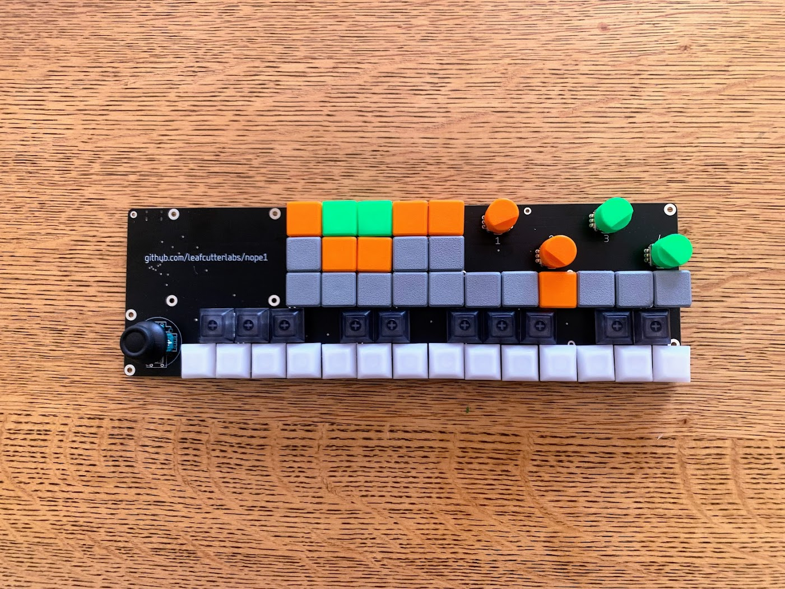

# nope1
OP-1/LMN-3 interface based on the RP2040. 

Current QMK firmware is very basic (only midi keyboard implemented 53-76 and the LMN-3 CC signals, encoder are now working in vial! analog is not working) 
Joystick Analog pins: 26, 27 
Known Issues: 
	-Joystick switch trace is not connected 
 ToDo: 
 	-Get Vial running - DONE
